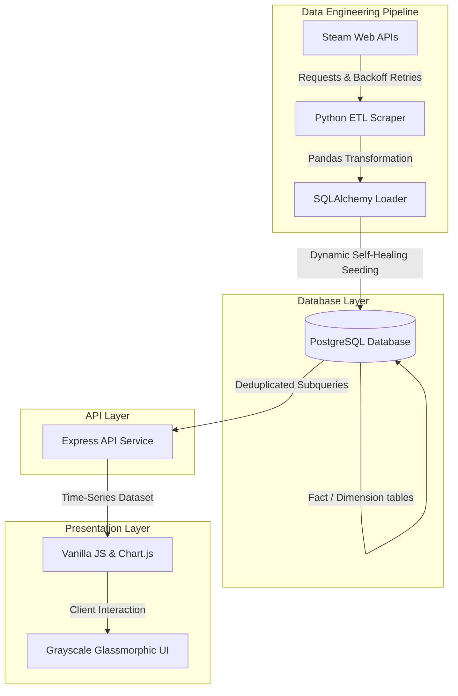

# SteamSight

An end-to-end analytical data platform designed to extract, model, and visualize real-time correlations between game concurrency, pricing fluctuations, and user sentiment across targeted Steam titles.

This project showcases full-stack analytics engineering capabilities—combining automated Python ETL pipelines, transactional database schema modeling, optimized SQL queries, and a modern, zero-dependency monochromatic telemetry dashboard.

---

## 🏗️ System Architecture



---

## 💡 Key Features & Analytical Engineering Focus

### 📡 1. Automated ETL Pipeline & Scraper (Python)
- **Multi-Endpoint Extraction**: Leverages the Valve Steam APIs to batch-extract live player counts (`ISteamUserStats`), pricing details (`appdetails`), and user review metrics (`appreviews`).
- **Resilient Engineering**: Implements an **exponential backoff retry algorithm** to gracefully handle Steam API rate-limiting (HTTP 429) and network timeouts, preventing false zero-values from polluting time-series datasets.
- **Data Structuring**: Processes raw JSON responses using `pandas` DataFrames, standardizing datatypes and alignment before ingestion.

### 🗃️ 2. Relational Database & Schema Design (PostgreSQL)
- **Time-Series Schema**: Models data across four tables—a `games` reference dimension table and three time-series fact tables (`telemetry`, `pricing_history`, `daily_reviews`) storing structural updates at precise timestamp logs.
- **Dynamic Seeding**: Features self-healing seeding logic. On server boot or ETL start, the system automatically runs schema migrations and seeds default game registries to ensure zero-config setups.
- **Deduplicated Analytics Queries**: Employs optimized nested SQL queries. Uses `DISTINCT ON` constraints wrapped in subqueries to pull the *single latest state* of each title, sorted by analytic parameters (e.g., player count descending).

### 🖥️ 3. Interactive Grayscale Telemetry Dashboard (Vanilla CSS/HTML/JS)
- **Responsive Aesthetics**: Utilizes a custom, framework-free monochromatic CSS design featuring glassmorphism overlays, custom typography, subtle micro-interactions, and responsive layouts.
- **Dynamic KPI Metrics**: Programmatically aggregates and renders real-time dashboard cards, calculating total active players and weighted sentiment percentages on the fly.
- **Temporal Analysis**: Provides dynamic 24H, 7D, and 30D history toggles. Users can filter line charts showing smooth-tension player concurrency trends over time.
- **Self-Service Export**: Features client-side search filtering of the live telemetry grid and a built-in CSV exporter utility that generates clean data spreadsheet downloads on the fly.

---

## 🛠️ Technology Stack

| Layer | Technologies | Purpose |
| :--- | :--- | :--- |
| **ETL Pipeline** | Python, Pandas, Requests, SQLAlchemy | Automated data extraction, parsing, and database insertion. |
| **Database** | PostgreSQL | Relational time-series data storage with foreign key constraints. |
| **Backend API** | Node.js, Express, pg Pool, Dotenv | Secure REST API layer providing parameterized database queries. |
| **Frontend** | Vanilla HTML5, CSS3, ES6 JavaScript | Framework-free layout serving dynamic UI calculations. |
| **Visualization** | Chart.js | Multi-type charting (Line, Bar, Stacked Bar) mapping grey tones. |

---

## 📁 Repository Structure

*   `data_pipeline/`: Python automated scraper scripts, requirements lists, and test files.
*   `database/`: PostgreSQL DDL schemas, seeding scripts, and telemetry queries.
*   `backend/`: Node.js Express server routes, middleware, and credential setups.
*   `frontend/`: HTML layouts, pure CSS grids, and chart initializers.
*   `scheduler.py`: Automation daemon running ETL extraction loops natively.

---

## 🚀 Getting Started

### 1. Database Setup
Spin up a local PostgreSQL instance, create a database named `steamsight_db`, and populate your local credentials inside `backend/.env`:
```env
DB_USER=postgres
DB_PASS=your_password
DB_HOST=localhost
DB_PORT=5432
DB_NAME=steamsight_db
PORT=5000
```

### 2. Boot the API Server
Install backend dependencies and launch the node server. The database schema will self-bootstrap automatically on startup:
```bash
cd backend
npm install
npm start
```
*The web server will run on `http://localhost:5000`.*

### 3. Run the Scraper Daemon
Install Python requirements and start the scheduled execution loop (runs ETL sync every 12 hours):
```bash
pip install -r data_pipeline/requirements.txt
python scheduler.py
```
*Note: Run scripts with `$env:PYTHONIOENCODING="utf-8"` on Windows terminals to support log emojis.*